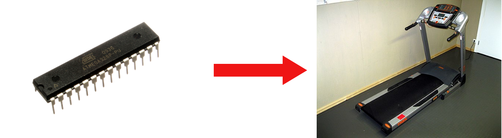

# COSHOW_MCU_Team_C2D2
We’re building a treadmill with ATmega328P and 74-series logic ICs as a 3-person team.

# 1. Project Overview (프로젝트 개요)
- 프로젝트 이름: CHeeeeap Treadmill
- 프로젝트 설명: COSHOW MCU 응용 경진대회의 예선 작품으로, ATmega328p와 기타 주변 회로로 제작한 매우 저렴한 트레드밀입니다.
 

 
 

# 2. Team Members (팀원 및 팀 소개)
+ 정재윤
+ 김민규
+ 이상민 

 
 

# 3. System Block Diagram 

 
 

# 4. Flow Chart

# 5. Circuit  
## 5-1. 전체 회로도
 
## 5-2. 부분 회로 1
 
## 5-3. 부분 회로 2
 

# 6. Tasks & Responsibilities (작업 및 역할 분담)
|이름|프로필|역할|
|-----------------|-----------------|-----------------|
| 정재윤(팀장)    |   | <ul><li>프로젝트 계획 및 관리</li><li>팀 리딩 및 커뮤니케이션</li><li>74HC595 라이브러리 개발</li><li>4digit-FND 라이브러리 개발</li><li>속도 연동 RGB LED 제어 프로토콜 개발</li><li>UART 디버깅 라이브러리 개발</li><li>회로설계</li><li>ADC기반 버튼 값 리딩 라이브러리 개발</li></ul>     |
| 김민규(팀원)   |  | <ul><li>Atmega328p Pin 매핑 관리</li><li>모터 구동부 (DC,Stepper) 라이브러리 개발</li><li>Hall Sensor를 이용한 엔코더 라이브러리 개발</li><li>비상정지 ISR 개발</li><li>악보 연동 음악 출력 라이브러리 개발</li><li>하드웨어 설계 및 제작</li></ul> |
| 이상민(팀원)   |      |<ul><li>HD44780 라이브러리 개발</li><li>로그인 페이지 개발</li><li>동아리 찾기 페이지 개발</li><li>동아리 프로필 페이지 개발</li><li>커스텀훅 개발</li></ul>  |
 
 

# 7. Technology Stack (기술 스택)
## 7.1 Language

 

## 7.2 Cooperation
    
 

